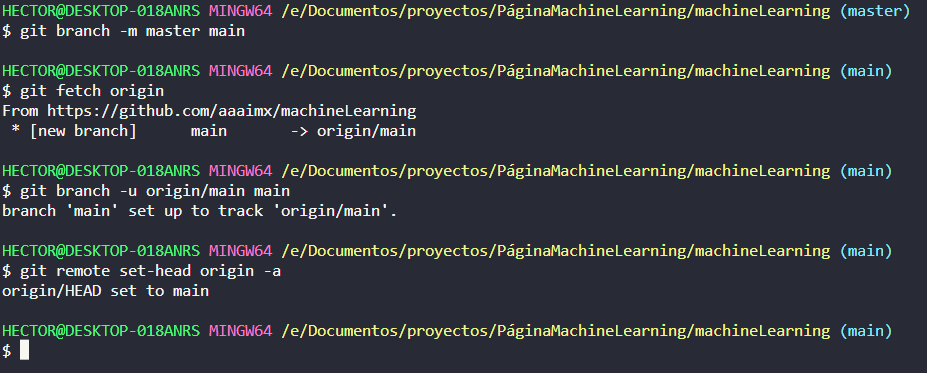

# ComandosGit
Desde los comandos básicos de git hasta comandos de cómo colaborar en equipo.
  Git -> **G***lobal* **I***nformation* **T***racker*

> Tomar notas en mardown [Guia](https://colab.research.google.com/notebooks/markdown_guide.ipynb#scrollTo=Lhfnlq1Surtk) 
> Respuestas a preguntas frecuentes de Git [first aid git](https://firstaidgit.io/#/) 
> Libro de Git [clic here](https://es.b-ok.lat/book/1304398/c08aba?dsource=recommend) 
> Libro para principiantes de Git-Hub [clic here](https://es.b-ok.lat/book/5008483/901c35)

## Inicializar un repositorio
`git init`

## Añadir un cambio al repositorio
`git add <namedelarchivo>`  
>Si se desean agragar todos los cambios `git add .`

## Hacer una confirmación de cambio
`git commit -m "comentario de cambio realizado"`

## Agregar el autor y email del repositirio
`git config --global user.email "correodeGitGub"`  `git config --global usar.name "nombredeGitHUb"`
## Configurar el repositirio remoto 
1. Ver los link remotos de `fetch` y `push`
   `git remote -v`
   *ejemplo modo remoto **ssh***
    
   *ejemplo modo remoto **https***
   
2. Agregar el repositirio remoto 
   `git remote add origin "link_https"`
## Subir cambios al repositorio
 

`git push origin "name_de_rama"`

## Actualizar el repositorio con los cambios nuevos o nomas por que sí
 

`git pull origin "name_de_rama"`

## Crear una rama

`git checkout "name_rama`

### Crear una rama y cambiarse a ella

`git checkout -b "name_rama`

## Revisar el hitorial de commits
 

`git log`

Variante: 

`git log --oneline`

## Recuperar un commmit con *git log --oneline*

`git reset --hard "hash_commit"`

## En caso de cambiarle el nombre a una rama en Git-Hub

Realizamos los siguientes comandos

