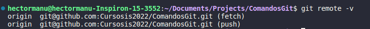

# ComandosGit
Desde los comandos básicos de git hasta comandos de cómo colaborar en equipo.

> Tomar notas en mardown [Guia](https://colab.research.google.com/notebooks/markdown_guide.ipynb#scrollTo=Lhfnlq1Surtk)

## Inicializar un repositorio

`git init`

## Añadir un cambio al repositorio
`git add <namedelarchivo>`
  Si se desean agragar todos los cambios `git add .`

## Hacer una confirmación de cambio
`git commit -m "comentario de cambio realizado"`

## Configurar el autor y gmail del repositirio
`git config --global user.email "correodeGitGub"`  `git config --global usar.name "nombredeGitHUb"`
## Configurar el repositirio remoto 
1. Ver los link remotos de `fetch` y `push`
   `git remote -v`
   *ejemplo modo remmoto **ssh***
   
2. 

